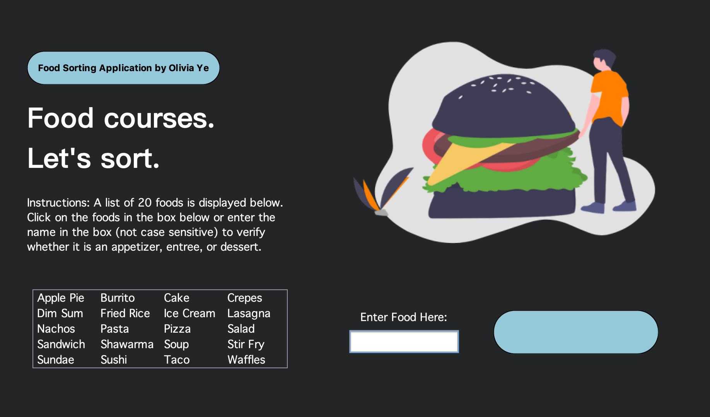

# Food Sorter by Course

Created as a take-home project for the RBC Innovation Developer 2020 application. Developed April 2021.

## Functionality

1. Reads `appetizers.txt`, `entrees.txt`, and `desserts.txt` to populate the list of foods
2. Reads `misspellings.txt` to populate an array of common misspellings for each food
3. Provides the user with two options to check their course of food: menu select, or manual input
4. Menu select returns determined course matches
5. Manual input returns determined courses matches if the inputted food name is a direct match, else,  
a. Checks the input to see if it contains a food name in the list (e.g. "onion soup" contains "soup") and displays the course of the containing food as a suggestion  
b. If unsuccessful, checks the misspellings array to see if it is a common misspelling of any of the names (e.g. "waffels" is a common misspelling of "waffles") and displays the course of the properly spelled food as a suggestion 

## Technical Details

• Uses the Netbeans GUI builder with custom designed components in classes and HTML code within text fields  
• Implements object oriented programming, where the user inputted food is an object  
• Uses queues to dynamically populate `appetizer`, `entree`, `dessert`, and `misspelling` 1D arrays with the foods inside the text files  
• Uses string tokenization to split the long string of misspellings into individual works when spell checking the user input  
• Uses insertion sort to sort words alphabetically to display on the menu input  
• Executes methods within the main file and class files to: load information from files into arrays, ensure valid input, sort strings, compare strings, and display information on the UI  

## Further Improvements

• Scale the program to be able to sort more foods by removing a limit of 20 foods  
• Implement machine learning to use pictures to sort foods rather than just names  
• Increase spell-check capabilities by using databases of common misspellings rather than a text file of common misspellings
